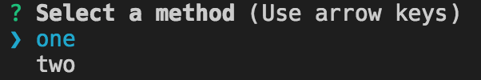
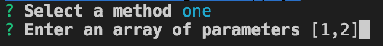
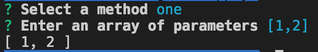

# CLI Apply

[](https://travis-ci.org/rphansen91/cli-apply)
[](https://codecov.io/gh/rphansen91/cli-apply)
[](https://www.npmjs.com/package/cli-apply)
[](https://www.npmjs.com/package/cli-apply)

## Description

CLI Apply is a simple way to create node applications that can be executed and interfaced with using the command line.

## Usage

```js
const cliApply = require('cli-apply')

cliApply({
  one: function (x, y) {
    return [x, y]
  },
  two: function (x, y) {
    return [y, x]
  }
}, {})
.then(function (result) {
  console.log(result)
})
```

1. When the file is executed, a terminal prompt will ask you which function you would like to execute.

  

2. Once selected an array can be supplied which will be the parameters of the function.

  

3. The specified function will be executed with the given parameters and will return the result.

  
